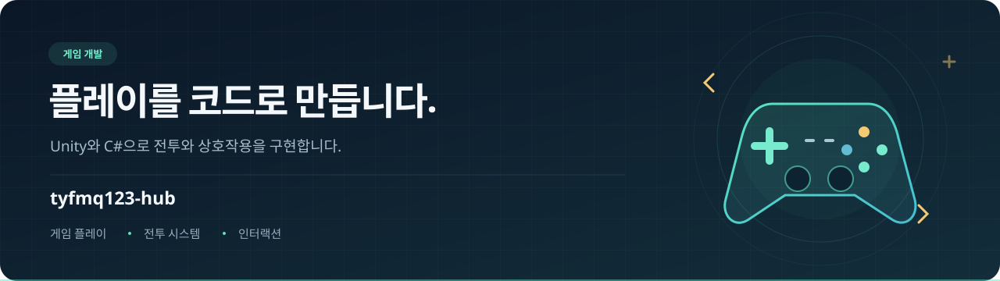

<!--
GitHub 프로필 README · tyfmq123-hub
공개 저장소 tyfmq123-hub/tyfmq123-hub의 루트에 이 README.md를 배치하고,
assets/profile-banner.svg도 같은 상대 경로로 업로드하세요.
적용 안내: https://docs.github.com/en/account-and-profile/how-tos/profile-customization/managing-your-profile-readme
저장소 문서, 코드와 병합 PR을 2026-10-08 기준으로 확인했습니다.
TODO: 공개할 실명, 이메일, 포트폴리오 링크를 추가하세요.
TODO: 프로젝트별 실제 개발 기간과 진행 상태를 확인하세요.
-->

  

  <strong>게임 플레이 · 전투 UI · MapleStory Worlds · XR 인터랙션</strong>

  
  
  
  
  
  

  <a href="#소개">소개</a> ·
  <a href="#대표-프로젝트와-주요-기능">대표 프로젝트</a> ·
  <a href="#기술-스택">기술 스택</a> ·
  <a href="#개발-기록">개발 기록</a>

## 소개

안녕하세요, **tyfmq123-hub**입니다.

Unity·C#과 메이플스토리 월드·mLua로 게임 플레이와 UI를 구현합니다. 플레이어의 입력이 전투와 화면에 자연스럽게 이어지도록 만드는 작업에 관심이 있습니다.

**Ratchemy Defense**의 아군·카드·결과 UI와 밸런스 도구, **메이플텍틱스**의 전투 HUD·스킬 예약 큐·유니온 UI를 작업했습니다. **HCl 누출 초동대응 VR 시뮬레이터**에서는 공용 XR과 단계별 훈련 흐름을 연결하는 팀 프로젝트에 참여했습니다.

## 개발자

| 항목 | 내용 |
| --- | --- |
| GitHub | [@tyfmq123-hub](https://github.com/tyfmq123-hub) |
| 주요 작업 | Unity·C# 게임 플레이, mLua 전투 UI, XR 장비 상호작용 |
| 협업 경험 | Ratchemy Defense 3인 팀 개발·PR 통합, 메이플텍틱스 기능 구현과 안정화, HCl VR 단계별 훈련 개발 |

<!-- TODO: 실명과 공개 가능한 연락처·포트폴리오를 추가하세요. -->

## 대표 프로젝트와 주요 기능

### 01 · [Ratchemy Defense](https://github.com/tyfmq123-hub/Ratchemy-Defense)

**유닛을 소환하고 배터리의 열폭주를 막는 2D 레인 디펜스 팀 프로젝트**

서로 다른 역할의 아군을 조합해 적 웨이브와 보스를 상대합니다. 3인 팀으로 전투, 기지·웨이브 관리, 씬 흐름과 UI를 나누어 구현했습니다.

- **아군 전투와 소환:** 5종 아군의 공격·스킬을 공통 기반 클래스 위에 구현했습니다. 카드 데이터와 코스트를 연결해 소환하고, 사망 시 코스트 일부를 환급합니다.
- **스토리와 결과 UI:** 만화 컷의 앞뒤 이동·자동 넘김과 승리·패배 결과 화면을 구현했습니다. HP·스킬 쿨다운 표시와 사운드도 전투 흐름에 연결했습니다.
- **밸런스 점검 도구:** 프리팹·ScriptableObject의 스탯으로 반복 전투를 시뮬레이션하고 리포트를 생성합니다. 브라우저 도구에서는 조합과 임시 스탯을 바꾸어 추정 승률을 비교할 수 있습니다.

`Unity` `C#` `URP 2D` `ScriptableObject` `uGUI` `JSON`

[아군 구현](https://github.com/tyfmq123-hub/Ratchemy-Defense/tree/develop/Assets/_Workspaces/Member_Jeon/1.Scripts/PlayerUnit) · [웹 밸런스 도구](https://github.com/tyfmq123-hub/Ratchemy-Defense/tree/develop/Assets/_Workspaces/Member_Jeon/BalanceSimWeb) · [QA 문서](https://github.com/tyfmq123-hub/Ratchemy-Defense/blob/develop/Docs/QA_Ratchemy_Defense.md)

### 02 · HCl 누출 초동대응 VR 시뮬레이터

**보호구 준비부터 현장 진입 전 확인, 누출 대응까지 이어지는 VR 안전훈련 팀 프로젝트**

산업 현장의 염산(HCl) 누출 사고 대응 절차를 가상 환경에서 연습합니다. 보호구 준비(PPE), 현장 진입 전 확인(PreEntry), 누출 대응(LeakResponse)을 공용 XR과 씬 흐름으로 연결한 전체 프로젝트입니다.

- **단계별 대응 훈련:** 보호구·장비 준비, 측정기를 이용한 진입 전 확인, 밸브 차단과 흡착재 설치·회수·폐기 절차를 하나의 훈련 흐름으로 구성합니다.
- **XR 상호작용과 상태 연계:** 손·레이 기반 장비 잡기와 착용을 지원합니다. 단계가 바뀌어도 준비한 장비와 설비 상태를 공유해 다음 절차로 이어갑니다.
- **진행 안내와 피드백:** 행동 순서와 완료 조건을 검증하고 음성·자막·UI로 진행 상황을 안내합니다.

`Unity` `C#` `XR Interaction Toolkit` `OpenXR` `XR Hands`

[전체 훈련 구조](https://github.com/tyfmq123-hub/HCl-PPE-Room-Build/blob/main/docs/integration/SHARED_XR_ARCHITECTURE.md) · [세 단계 통합 문서](https://github.com/tyfmq123-hub/HCl-PPE-Room-Build/blob/main/docs/integration/STAGE_EDITING_BOUNDARIES.md) · [통합 씬 구성](https://github.com/tyfmq123-hub/HCl-PPE-Room-Build/blob/main/ProjectSettings/EditorBuildSettings.asset)

### 03 · [메이플텍틱스 · MapleTactics](https://github.com/MagunMadown/MapleTactics)

**메이플스토리 월드에서 개발하는 1차원 턴제 전술 로그라이크 팀 프로젝트**

적의 행동 예고를 읽고 칸 이동·방향 전환·스킬 예약을 조합해 전투를 풀어갑니다. 전사·마법사·궁수·도적·해적의 다섯 직업과 유물·스킬 증강으로 매번 다른 빌드를 구성합니다.

- **전술 전투와 스킬 큐:** 적의 다음 행동을 확인하고 이동과 스킬 실행 순서를 결정합니다. 스킬바·예약 큐를 드래그로 정렬하며 서버가 전투 상태와 입력을 검증합니다.
- **분기형 런과 빌드 성장:** 지역 노드를 선택하며 전투·상점·스킬 획득·강화를 진행합니다. 유물과 증강을 조합해 직업별 전투 방식을 바꿉니다.
- **유니온과 영구 성장:** 직업별 성장, 유니온 코인 상점, 영구 스탯 강화와 스킬 트리를 통해 다음 도전을 준비합니다.

**담당 작업:** 전투 HUD, 스킬 드래그·예약 큐, 유니온 UI 구현. 전투 입력·피드백과 런 진행·저장 안정화에 참여했습니다.

`MapleStory Worlds Maker` `mLua` `CSV / UserDataSet` `DataStorageService`

[스킬 드래그·큐 PR](https://github.com/MagunMadown/MapleTactics/pull/52) · [유니온 UI PR](https://github.com/MagunMadown/MapleTactics/pull/51) · [전투·런 안정화 PR](https://github.com/MagunMadown/MapleTactics/pull/131) · [v1.0.2 릴리스](https://github.com/MagunMadown/MapleTactics/releases/tag/v1.0.2)

  

## 기술 스택

대표 프로젝트에서 사용한 기술을 분야별로 정리했습니다.

| 분야 | 기술 | 활용 |
| --- | --- | --- |
| 언어 | C#, mLua | Unity 게임 로직·XR, 메이플텍틱스 전투·UI |
| 게임 제작 환경 | Unity 6, MapleStory Worlds Maker | 디펜스 게임, VR 안전훈련, 턴제 전술 로그라이크 |
| 그래픽·UI | URP, uGUI, TextMesh Pro | 화면 렌더링, 카드·체력·결과 UI |
| XR | XR Interaction Toolkit, OpenXR, XR Hands | 손·레이 상호작용과 장비 착용 |
| 데이터 | ScriptableObject, JSON, CSV, UserDataSet | 유닛·스킬 스탯, 밸런스 설정과 게임 데이터 |
| 저장·검증 | MSW DataStorageService, 서버 입력 검증 | 메이플텍틱스 성장·런 저장과 전투 상태 검증 |
| 개발 도구 | HTML, JavaScript | 브라우저 기반 밸런스 시뮬레이터 |
| 협업 | Git, GitHub, Git LFS | 기능 브랜치·PR 통합, 대형 자산 관리 |

## 개발 기록

저장소 문서와 **커밋 기록 기준**이며, 날짜는 한국 시간입니다. 기록 범위는 실제 개발 시작·종료일과 다를 수 있습니다.

| 기록 범위 | 프로젝트 | 확인된 작업 |
| --- | --- | --- |
| 2026.05.22 ~ 2026.06.16 | Ratchemy Defense | 아군·카드·결과 UI, 밸런스 도구, 제출용 브랜치 통합 |
| 2026.07.14 ~ 진행 중 | 메이플텍틱스 | 전투·유니온 UI와 안정화. **2026.10.06 v1.0.2 릴리스** |
| 2026.09.18 | HCl 누출 초동대응 VR 시뮬레이터 | 세 단계 훈련 소스와 통합 구조의 공개 스냅샷 |

<!-- TODO: 실제 개발 기간, 주요 이정표와 현재 진행 상태를 확인해 갱신하세요. -->

## 개발 환경

| 항목 | 확인된 설정·문서 |
| --- | --- |
| Unity 에디터 | Ratchemy Defense·HCl VR: **6000.4.8f1** |
| 메이플텍틱스 | **MapleStory Worlds Maker**, mLua / 월드 CoreVersion **26.7.0.0** |
| Unity 패키지 | URP **17.4.0**, Input System **1.19.0**, uGUI **2.0.0** |
| XR 패키지 | XR Interaction Toolkit **3.4.1**, OpenXR **1.16.1**, XR Hands **1.7.3** — HCl XR 작업 기준 |
| IDE·작업 도구 | Ratchemy Defense 팀 문서에 **Cursor·Unity·GitHub** 명시 |
| 실행 대상 | Ratchemy Defense **Windows 64비트** 빌드 / 메이플텍틱스 **메이플스토리 월드** |

<!-- TODO: 실제 개발 OS와 프로젝트별 사용 IDE를 추가하세요. -->

버전은 각 저장소의 `ProjectVersion.txt`, `manifest.json`, `packages-lock.json`, `WorldConfig.config`와 프로젝트 문서를 기준으로 정리했습니다.

## 연락

[GitHub 프로필](https://github.com/tyfmq123-hub) · [전체 저장소](https://github.com/tyfmq123-hub?tab=repositories)

<!-- TODO: 공개할 이메일과 포트폴리오 URL을 추가하세요. -->
